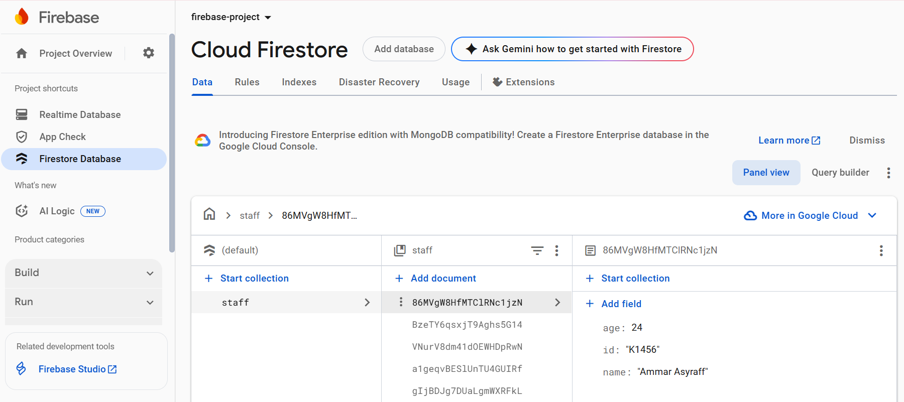
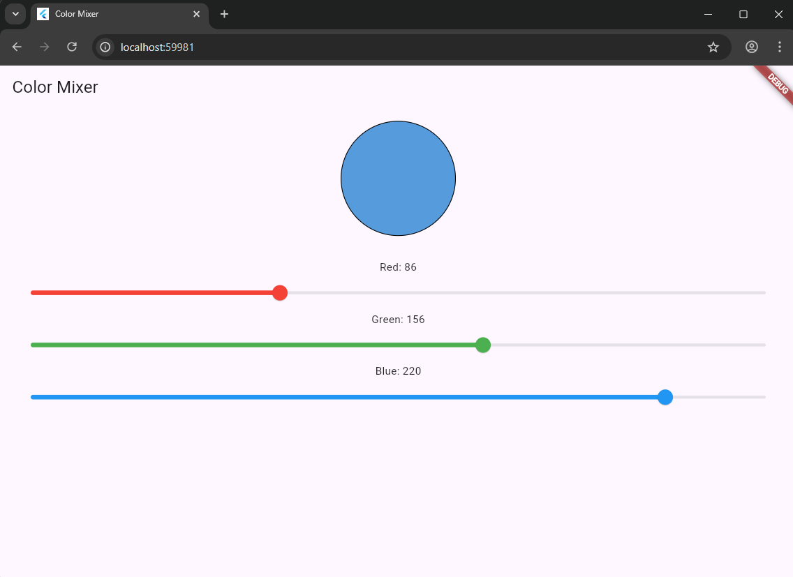
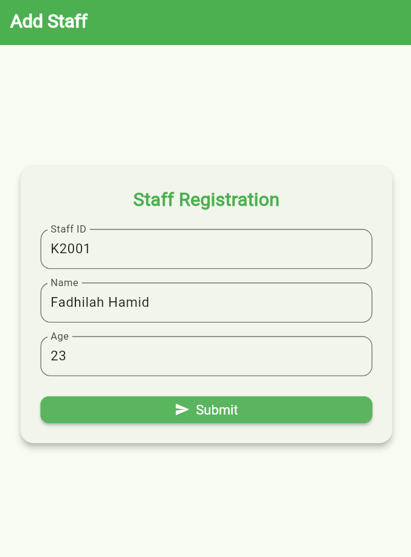
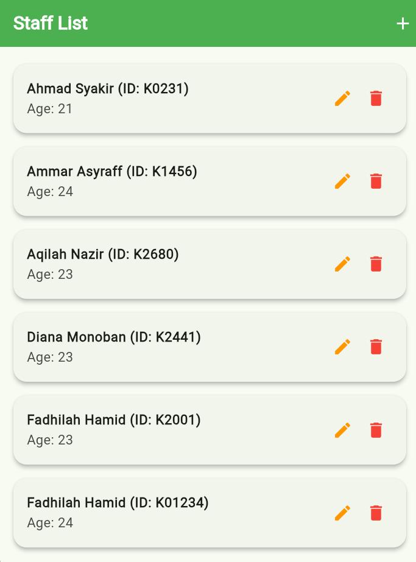
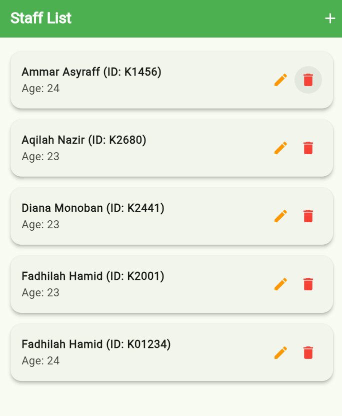

# flutter_firebase_crud_lab

A complete Flutter Firebase CRUD application for managing staff registration.

## 📋 Project Overview

This app allows users to **add**, **view**, **edit**, and **delete** staff records using **Cloud Firestore**. Designed with clean UI using Material 3, it supports both mobile and web platforms.

## ✨ Features

- 🔥 Firebase integration (Firestore, Core)
- 📄 Staff registration form with validation
- 📋 Dynamic list of staff entries with live updates
- ✏️ Edit staff details via popup dialog
- 🗑️ Delete staff with confirmation
- 🎨 Material 3-based responsive UI

## 📸 Screenshots

> Firebase interface

1. Cloud Firestore  


> Flutter page

1. Add staff form  



2. Staff list  


3. Edit staff  


4. Delete staff  



---

## 🧑‍💻 Tech Stack

| Technology   | Description                           |
|--------------|---------------------------------------|
| Flutter      | Cross-platform UI toolkit             |
| Dart         | Language used by Flutter              |
| Firebase     | Backend services (Firestore & Core)   |
| Firestore    | NoSQL cloud database (real-time sync) |
| Material 3   | Modern UI styling                     |

---

## 🚀 Getting Started

### 1️⃣ Prerequisites

- Flutter SDK: [Install Flutter](https://flutter.dev/docs/get-started/install)
- Firebase project: [Create Firebase Project](https://console.firebase.google.com/)

### 2️⃣ Clone the Repository

```bash
git clone --branch flutter_firebase_crud_lab https://github.com/dylaascreate/flutter-project.git
cd flutter-project
```

### 🗂️ Project Structure

lib/
├── pages/
│   ├── staff_form_page.dart       # Staff registration form
│   └── staff_list_page.dart       # Staff list with edit/delete options
├── firebase_options.dart          # Generated Firebase config
└── main.dart                      # App entry point and theme setup


